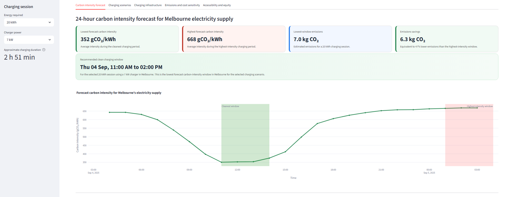
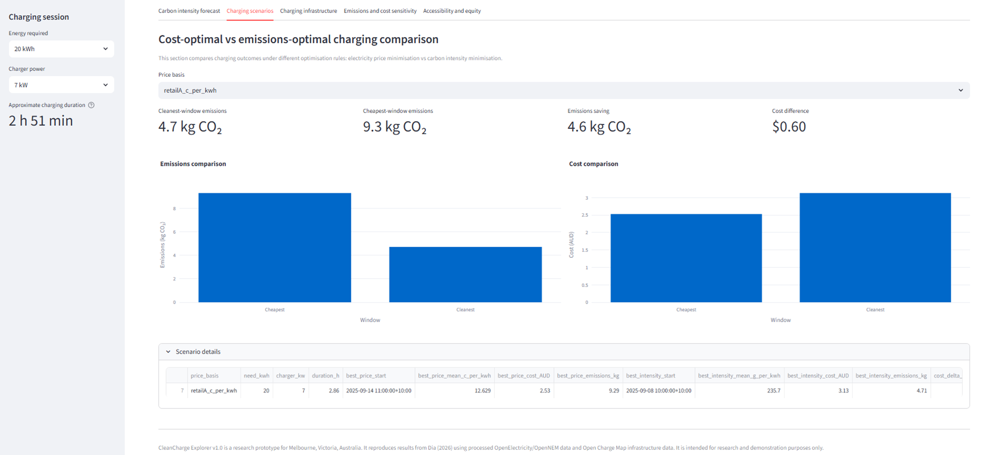
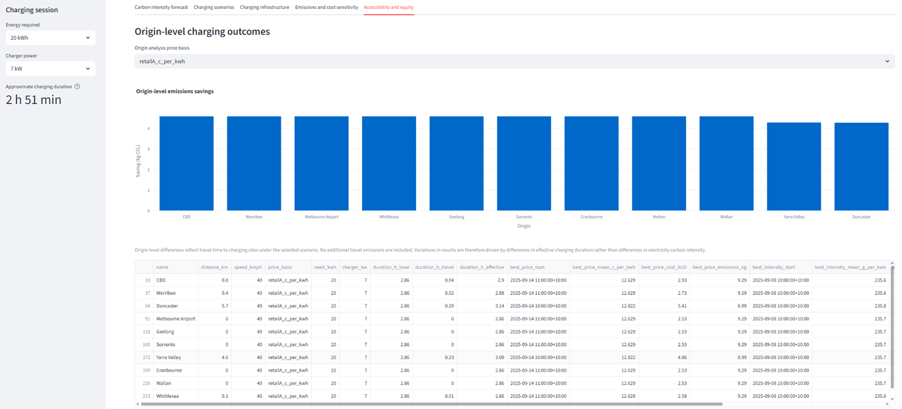

# CleanCharge

[](https://doi.org/10.1080/15568318.2026.2693676)
[](https://doi.org/10.5281/zenodo.17232110)
[]()

A reproducible research software system for analysing when, where, and how electric vehicles can be charged with lower electricity carbon intensity in Melbourne.

---

## Overview

**CleanCharge** is an open source research toolkit for emissions aware electric vehicle charging using open electricity and charging infrastructure data.

It accompanies the peer reviewed paper:

> **Dia, H. (2026). _CleanCharge: Emissions-aware electric vehicle charging and infrastructure equity with open data in Melbourne._ International Journal of Sustainable Transportation, 1–27.**  
> https://doi.org/10.1080/15568318.2026.2693676

CleanCharge demonstrates how publicly available electricity, pricing and charging infrastructure data can be combined to:

- forecast electricity grid carbon intensity over the next 24 hours
- identify lower emissions charging windows
- compare cleanest and cheapest charging strategies
- quantify potential emissions savings under different charging scenarios
- analyse public fast charging infrastructure across Melbourne
- explore accessibility and equity across representative origins

The repository includes both the research workflow used in the published study and the interactive **CleanCharge Explorer** Streamlit dashboard.

👉 **Research prototype.** CleanCharge is intended for research, education and reproducible analysis. It is **not** a live operational EV charging recommendation service.

---

## Repository structure

```
cleancharge/
│
├── app.py                          # CleanCharge Explorer Streamlit dashboard
├── data/
│   └── dashboard/                  # Dashboard datasets
│
├── src/
│   ├── analyse/                    # Analysis and forecasting scripts
│   ├── fetch/                      # Data acquisition and preprocessing
│   └── plots/                      # Figure generation
│
├── requirements.txt
├── run_from_existing_data.ps1
├── README.md
└── LICENSE
```

The repository contains two complementary components:

**Research workflow**

The scripts in `src/` reproduce the analyses presented in the published paper, including forecasting, charging optimisation, infrastructure assessment and visualisation.

**Interactive dashboard**

`app.py` launches the **CleanCharge Explorer**, an interactive Streamlit dashboard that allows users to explore the archived study results without running the full analysis pipeline.

---

## 🚀 Latest release

**CleanCharge Explorer v1.0**

Released: July 2026

Companion software for:

Dia, H. (2026). *CleanCharge: Emissions-aware electric vehicle charging and infrastructure equity with open data in Melbourne.* International Journal of Sustainable Transportation.

Highlights:

- Interactive Streamlit dashboard
- 24-hour carbon intensity forecasting
- Emissions-aware charging scenarios
- Infrastructure accessibility and equity analysis
- Fully reproducible workflow using open data

---

## 🚀 Quick start

### 1. Clone the repository

```bash
git clone https://github.com/hdia/cleancharge.git
cd cleancharge
```

### 2. Create a Python environment

```powershell
python -m venv .venv
Set-ExecutionPolicy -Scope Process -ExecutionPolicy Bypass
.\.venv\Scripts\Activate.ps1
pip install -r requirements.txt
```

### 3. Launch the CleanCharge Explorer dashboard

```powershell
streamlit run app.py
```

This opens the interactive dashboard, allowing you to explore the published CleanCharge results without running the complete analysis workflow.

### 4. Reproduce the published analysis (optional)

Download the processed datasets from Zenodo (see **Data inputs** below), place them in:

```text
data/processed/
```

Then execute:

```powershell
.\run_from_existing_data.ps1
```

This reproduces the analyses presented in the published paper and regenerates the summary outputs and figures.

### 5. Run individual analysis modules (optional)

```bash
python src/analyse/forecast_intensity.py
python src/analyse/ev_charging_analyser_system.py
python src/analyse/ev_charging_analyser_per_origin.py
python src/analyse/savings_sensitivity.py
```

---

## 📊 Data inputs

The CleanCharge workflow uses two authoritative processed electricity datasets derived from the OpenElectricity API.

| Dataset | Description |
|---------|-------------|
| `openelectricity_90d_hybrid_local_with_intensity.csv` | 90-day electricity dataset used for descriptive analysis, charging optimisation and forecasting |
| `openelectricity_emissions_30d_local.csv` | 30-day emissions dataset used for validation and comparison |

These datasets correspond to the archived datasets used in the published CleanCharge study.

👉 **Download the datasets from Zenodo**

https://doi.org/10.5281/zenodo.17232110

Place both files in:

```text
data/processed/
```

The helper script `run_from_existing_data.ps1` assumes this directory structure and will reproduce the analyses used in the published paper.

The interactive **CleanCharge Explorer** dashboard uses the processed outputs generated by these scripts, allowing users to explore the published results without re-running the full workflow.

---

## 📈 Outputs

Running the CleanCharge workflow generates a series of reproducible datasets, summary tables and visualisations.

### Analysis outputs

Written to:

```text
data/processed/ev_outputs/
```

These outputs are programmatically generated artifacts used for analysis and reproduction of the published study. They are not visual dashboard elements.

### Figures

Written to:

```text
results/figures/
```

These include publication-quality figures such as:

- carbon intensity forecasts
- charging scenario comparisons
- emissions sensitivity plots
- infrastructure accessibility maps
- origin-level equity visualisations

These outputs reproduce the analyses and figures presented in the published CleanCharge study.

---

## 📷 CleanCharge Explorer (visual overview)

The following figures show the interactive CleanCharge Explorer dashboard used to explore the published results.

---

### Figure 1 — Carbon intensity forecast and charging window

This view shows the 24-hour forecast of electricity carbon intensity and identifies the lowest-emission charging window for a selected EV charging scenario.

### Figure 2 — Charging scenarios (cost vs emissions)

Comparison of emissions-optimal and cost-optimal charging strategies under Retail A pricing, highlighting the trade-off between electricity cost and carbon intensity.

### Figure 3 — Accessibility and equity analysis

Origin-level analysis of charging accessibility, showing how travel time and spatial location influence effective access to low-emission charging opportunities in Melbourne.

---

## Dependencies

- All dependencies are pinned in `requirements.txt`.  
- Tested on **Python 3.11+**.

---

## Contributing

Contributions are welcome, particularly in the form of bug reports, documentation improvements, or enhancements to analysis modules.

Please open an issue or submit a pull request for discussion.

---

## License

[MIT License](LICENSE)

---

## 📚 Citation

If you use CleanCharge in your research, please cite the appropriate resource below.

### Journal article

Dia, H. (2026). *CleanCharge: Emissions-aware electric vehicle charging and infrastructure equity with open data in Melbourne.* International Journal of Sustainable Transportation, 1–27.
https://doi.org/10.1080/15568318.2026.2693676

### Processed datasets

Dia, H. (2025). *CleanCharge processed electricity datasets (30-day and 90-day).* Zenodo.
https://doi.org/10.5281/zenodo.17232110

### Source code

Dia, H. (2025). *CleanCharge analysis and forecasting toolkit.* Zenodo.
https://doi.org/10.5281/zenodo.17232338

## ⚠️ Disclaimer

CleanCharge is an open-source research project developed to support reproducible research into emissions-aware electric vehicle charging.

The analyses and dashboard are based on processed historical datasets and the modelling assumptions described in the accompanying journal article. They are intended for research, education and demonstration purposes only and should not be interpreted as real-time operational charging advice.

---

## 🙏 Acknowledgements

CleanCharge builds upon openly available data provided by:

- **OpenElectricity / OpenNEM** for electricity system data
- **Open Charge Map** for public EV charging infrastructure

The author gratefully acknowledges the developers and maintainers of these open-data initiatives, whose work makes transparent and reproducible research possible.

